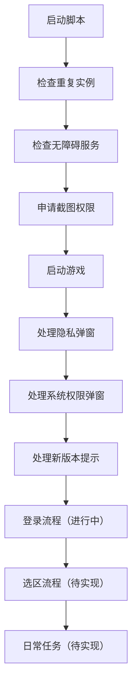

<div align="center">

# RXCS

**基于 AutoJS6 的《热血传说》Android 自动化项目**

以 **控件优先、图片兜底、分步校验、失败即停** 为核心原则，构建稳定、可验证、可扩展的 Android 自动化流程。


</div>

---

## ✨ 项目简介

RXCS 是一个围绕 **《热血传说》登录与后续流程自动化** 搭建的 AutoJS6 工程化项目。

当前主线目标是先把这条最小可用链路稳定下来：

> 启动游戏 → 处理弹窗 → 进入登录页 → 完成登录 → 进入选区与后续任务

和“能跑一次”相比，这个项目更关注：

- **可验证**：每一步都能确认是否真的成功
- **可调试**：先做原子测试，再整合完整链路
- **可维护**：把业务规则、资源规范、动作封装、设计文档拆开管理
- **可扩展**：后续可以平滑接入选区、主页识别、日常任务等能力

---

## 🚀 当前能力

### 已完成

- [x] 单实例守护，避免脚本重复运行
- [x] 无障碍服务检查
- [x] 截图权限请求
- [x] 启动游戏包：`com.sjgwer.dbbyh`
- [x] 隐私声明弹窗识别与处理
- [x] 权限弹窗识别与处理
- [x] 新版本提示图像识别
- [x] 公共动作、日志、延迟、图片处理模块拆分
- [x] OpenSpec 变更设计与任务拆解

### 进行中

- [ ] 登录页 ready 检测
- [ ] 用户名输入与回读校验
- [ ] 密码输入与回读校验
- [ ] 协议勾选状态识别与切换
- [ ] 登录按钮点击与结果校验

### 下一步

- [ ] 选区流程
- [ ] 登录成功后页面特征识别
- [ ] 日常任务流程
- [ ] 更完整的调试模式与原子测试入口

---

## 🧠 核心设计原则

### 1. 控件优先，图片兜底

- 用户名、密码、登录按钮：优先使用控件 `id`
- 协议状态、特定视觉目标：使用截图资源兜底

这样做的目标很明确：**输入要稳定，识别要可控，图片只用在真正需要视觉判断的地方。**

### 2. 先单测，后整合

登录链路不会一上来就跑 full flow，而是优先拆成原子动作验证，例如：

- `login_page_ready`
- `login_input_user_only`
- `login_input_pwd_only`
- `login_agree_only`
- `login_click_only`
- `login_full`

### 3. 动作后必须回读校验

不是“点过了”“输过了”就算成功，而是要验证：

- 目标控件是否真的发生变化
- 非目标输入框是否被污染
- 页面是否真的进入下一状态

### 4. 失败即停

任何一步失败，都不允许继续乱点、乱输、乱跳状态。先停下来，先定位根因，再继续推进。

---

## 🔄 流程概览



---

## ⚡ 快速开始

### 环境要求

- Android 设备 / 模拟器
- [AutoJS6](https://github.com/SuperMonster003/AutoJs6)
- 已开启无障碍服务
- 允许脚本申请截图权限
- Node.js（仅用于类型声明与本地开发辅助）

### 安装依赖

```bash
npm install
```

### 安装 / 链接 AutoJS6 类型声明（可选但推荐）

```bash
npm run dts
npm run dts-link
```

执行后会在项目根目录生成 `declarations` 软链接，方便编辑器补全。

### 运行方式

1. 使用 AutoJS6 打开项目
2. 确认无障碍服务已开启
3. 首次运行时授权截图权限
4. 运行入口文件：`main.js`

---

## 📁 项目结构

```text
rxcs/
├─ assets/                 # 图片资源与截图规范
├─ docs/autojs6/           # AutoJS6 本地工程化文档沉淀
├─ modules/                # 公共模块与业务模块
├─ openspec/               # 项目规则、设计、规格、任务
├─ .internal/              # 本地开发辅助脚本
├─ main.js                 # 项目入口
├─ package.json            # npm 依赖与脚本
├─ project.json            # AutoJS6 项目配置
└─ tsconfig.json           # 类型支持配置
```

### 关键文件

- `main.js`：入口，负责实例守护并启动主流程
- `modules/rxcs.js`：当前主业务流程骨架
- `modules/rxcs-config.js`：应用包名、资源路径、识别阈值等配置
- `assets/README.md`：截图资源命名与裁剪规范
- `openspec/project.md`：项目上下文与核心规则

---

## 🛠 开发文档

- [项目上下文](./openspec/project.md)
- [登录能力提案](./openspec/changes/add-rxcs-login-flow/proposal.md)
- [登录能力设计](./openspec/changes/add-rxcs-login-flow/design.md)
- [登录能力任务清单](./openspec/changes/add-rxcs-login-flow/tasks.md)
- [AutoJS6 本地文档入口](./docs/autojs6/README.md)
- [资源截图规范](./assets/README.md)

如果你准备继续做登录模块，推荐阅读顺序：

1. `openspec/project.md`
2. `openspec/changes/add-rxcs-login-flow/design.md`
3. `openspec/changes/add-rxcs-login-flow/tasks.md`
4. `assets/README.md`
5. `modules/rxcs.js`

---

## 🧩 当前模块说明

### `modules/instance-guard.js`

负责处理重复运行实例，避免同一脚本并发执行造成状态污染。

### `modules/action-utils.js`

封装点击、控件点击、图片匹配、图片点击等基础动作。

### `modules/image-utils.js`

负责图片读取、释放等底层处理，避免图像资源泄露。

### `modules/delay-utils.js`

管理页面切换、弹窗处理、启动阶段等延迟策略。

### `modules/log-utils.js`

统一日志级别与输出风格，便于调试与复盘。

### `modules/rxcs.js`

当前主流程骨架，已经覆盖启动、弹窗处理和新版本提示处理，后续会继续接入登录能力。

---

## 🗺 Roadmap

### Phase 1 - 启动与前置弹窗

- [x] 启动目标 App
- [x] 处理隐私弹窗
- [x] 处理权限弹窗
- [x] 识别新版本提示

### Phase 2 - 登录能力

- [ ] 登录页 ready 检测
- [ ] 用户名 / 密码安全输入
- [ ] 协议状态检测与勾选
- [ ] 登录结果校验
- [ ] 原子测试模式

### Phase 3 - 登录后流程

- [ ] 选区
- [ ] 首页识别
- [ ] 日常任务
- [ ] 状态恢复与异常回退

---

## 📸 资源规范

当前项目已经使用 / 计划使用的关键图片资源包括：

- `assets/new_version_tip.png`
- `assets/new_version_confirm.png`
- `assets/login_btn.png`
- `assets/agree_no.png`（规划中）
- `assets/agree_yes.png`（规划中）

截图规则见：[`assets/README.md`](./assets/README.md)

核心要求：

- 只裁目标控件本体
- 不要带高亮框、手指、辅助线
- 保持原始清晰度
- 文件命名必须固定

---

## 🤝 贡献建议

当前项目更适合按下面节奏推进：

1. 先补规格，再改代码
2. 先补原子测试，再接整合流程
3. 先确认运行时行为，再回头整理文档
4. 每次只改一个变量，保证问题可复现、可回滚

如果你要继续扩展功能，建议优先保持以下边界：

- **不要**跳过输入回读校验
- **不要**把图片识别扩散到所有步骤
- **不要**在失败状态继续后续动作
- **不要**在没有文档约束时直接堆业务逻辑

---

## 📚 参考

本 README 的结构风格参考了 GitHub 高星项目常见写法：强调**一句话定位、快速开始、目录导航、路线图、贡献说明**，更适合后续公开托管与持续维护。

- [freeCodeCamp/freeCodeCamp](https://github.com/freeCodeCamp/freeCodeCamp)
- [sindresorhus/awesome](https://github.com/sindresorhus/awesome)

---

## ⭐ 最后

如果这个项目后续要公开维护，这份 README 可以继续往两个方向增强：

- 增加 **运行截图 / GIF 演示**
- 增加 **调试模式说明 / 常见问题 / 贡献规范 / LICENSE**

当前版本已经适合作为项目首页说明、开发入口和后续迭代的骨架文档。
